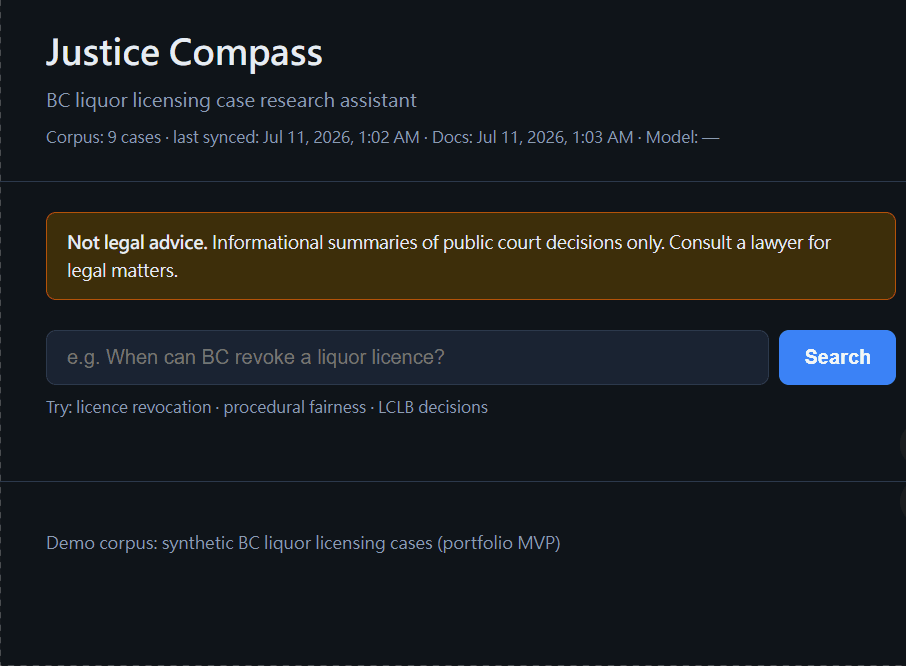
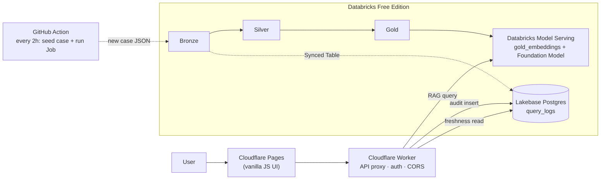
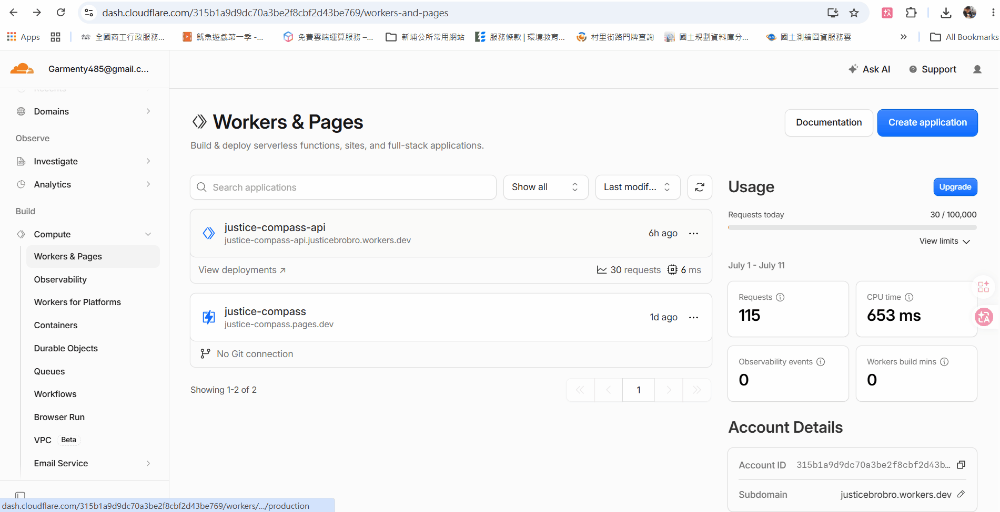
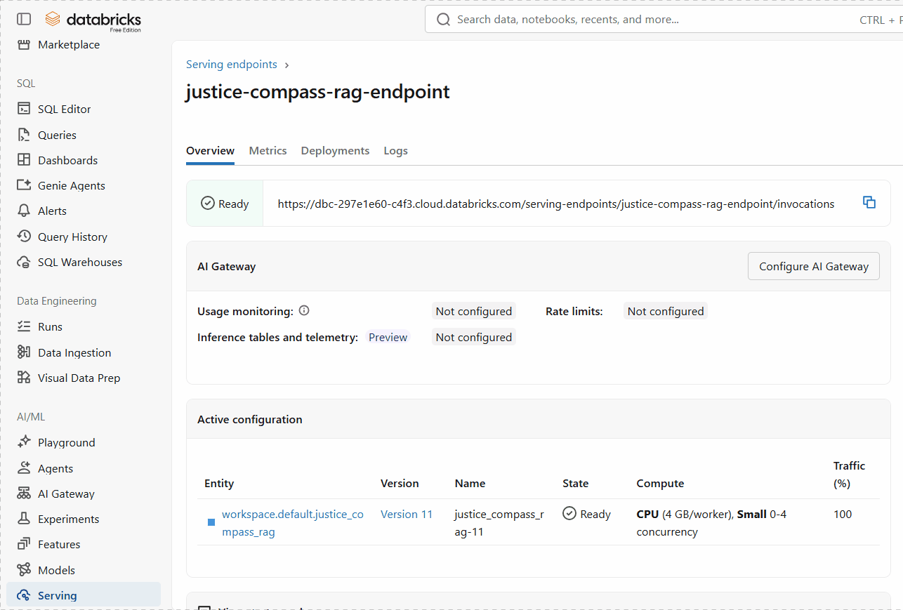
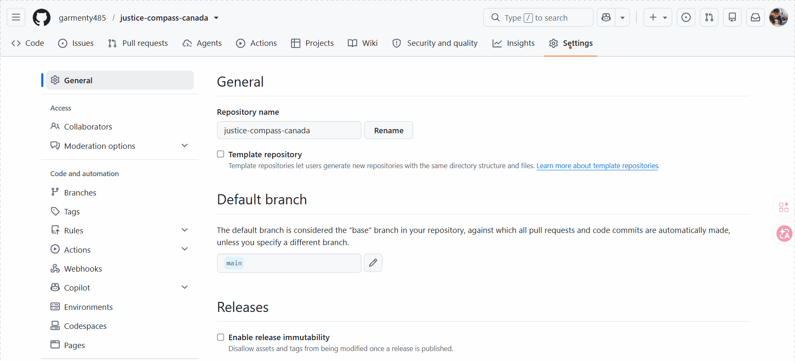

# Justice Compass 🍁⚖️

🔗 **[Live demo](https://justice-compass.pages.dev/)** — the author's own deployment. (This is the author's instance, not yours — see the **Personalization checklist** below before you deploy your own.)

🀄 **[中文簡潔版](README.zh-TW.md)** — 只列操作步驟，跳過介紹，直接看怎麼跑起來。

A Canadian legal case **RAG (Retrieval-Augmented Generation)** assistant, focused on **BC Liquor Control and Licensing Act** jurisprudence — built end-to-end on a **Databricks Lakehouse** (Medallion architecture + Lakebase) and served through **Cloudflare's edge** (Workers + Pages), with **AI-reviewed CI/CD** on every pull request.

Ask a question like *"When can BC revoke a liquor licence?"* and get a plain-language answer with **cited sources**, generated from a synthetic demo corpus of BC case law in `data/sample/`.



> **This is a portfolio / reference project**, not a production legal product. It ships pointed at the author's own demo deployment by default — follow the guide below to stand up your **own independent instance** (all free-tier).

---

## Why this exists

| Layer | What it demonstrates |
|-------|----------------------|
| **Medallion Architecture** | Bronze → Silver → Gold Delta pipeline (`databricks/notebooks/`) |
| **Lakehouse ↔ Operational DB** | Lakebase Synced Tables (Lake→Base) + query audit log (Base) |
| **RAG / vector retrieval** | Delta `gold_embeddings` + cosine similarity, served via an MLflow pyfunc model |
| **Edge-serverless API** | Cloudflare Worker proxy (auth, CORS, freshness metadata) + Pages static UI |
| **AI-native CI/CD** | A different LLM (Gemini) reviews every PR opened against this repo |
| **Zero-cost stack** | Runs entirely on free tiers — see [Prerequisites](#prerequisites) |

---

## Architecture



1. User asks a question on the **Pages** UI.
2. The **Worker** forwards it to a **Databricks Model Serving** endpoint (or returns a mock answer if not configured yet).
3. The Serving endpoint retrieves the top-k chunks from **Delta `gold_embeddings`** (cosine similarity) and asks a Foundation Model to answer using only that context.
4. The answer + citations are returned to the UI; the query is logged to **Lakebase** for audit.
5. The homepage shows **corpus / docs / model freshness**, read from Lakebase and MLflow via the Worker's `/meta` endpoint.
6. *(Optional, Step 8 below)* Every 2 hours a **GitHub Action** seeds a new synthetic case JSON, which the Databricks Job ingests into **Bronze** (`01`) and carries through `02→03→05→09` — that same Bronze-derived case metadata is what **Synced Tables** replicates into Lakebase (not from Gold, which only holds vectors for retrieval).

Deeper dives: [`docs/ARCHITECTURE.md`](docs/ARCHITECTURE.md) · [`docs/LAKEBASE.md`](docs/LAKEBASE.md) · [`docs/JOBS.md`](docs/JOBS.md) · [`docs/DATA_GOVERNANCE.md`](docs/DATA_GOVERNANCE.md)

---

## Prerequisites

All free tiers — no credit card charge required for the MVP scope.

| Account | Used for | Sign up |
|---------|----------|---------|
| **GitHub** | Host your fork, run CI/CD | Free plan is enough (unlimited private repos too) |
| **Cloudflare** | Worker (API) + Pages (UI) | [dash.cloudflare.com/sign-up](https://dash.cloudflare.com/sign-up) |
| **Databricks Free Edition** | Medallion pipeline, RAG serving, Lakebase | [databricks.com/learn/free-edition](https://www.databricks.com/learn/free-edition) |
| **Google AI Studio** *(optional)* | Gemini API key for the AI PR-review workflow | [aistudio.google.com/apikey](https://aistudio.google.com/apikey) |

Local tooling: **Node.js 20+**, **Python 3.10+**, [`wrangler`](https://developers.cloudflare.com/workers/wrangler/) CLI (installed via `npm install`).

---

## ⚠️ Personalization checklist

This repo ships pointed at the **author's own** demo deployment by default. Read this before you deploy your own copy — it's short.

### 🔴 The one thing that actually breaks if you skip it

| File | Hardcoded value | What happens if you don't change it |
|---|---|---|
| [`cloudflare/pages/js/config.js`](cloudflare/pages/js/config.js) | Author's Worker URL (`justice-compass-api.justicebrobro.workers.dev`) | Your deployed Pages UI will call **the author's** Worker/API instead of yours. Fixed in Step 3 below — it's a one-line edit. |

### 🟡 Things that only matter if you want the automated CI/CD to work

| File | Hardcoded value | Change to |
|---|---|---|
| `.github/workflows/deploy-pages.yml` (`--project-name=justice-compass`) | Cloudflare Pages project name | Match whatever name you give your Pages project in Step 3, **or** just name your project `justice-compass` |
| Databricks secret scope name `justice-compass` | Referenced by every notebook | Create a scope with this **exact name** in your own workspace (Step 4) — simplest path, no code change needed |

### 🟢 Not hardcoded at all — secrets and placeholders by design, nothing to edit here

| Item | How it's actually set |
|---|---|
| Databricks workspace URL / token | GitHub Secrets `DATABRICKS_HOST` / `DATABRICKS_TOKEN` — never committed (Steps 7–8) |
| RAG Serving endpoint URL | Worker secret `DATABRICKS_SERVING_URL` (Step 6) |
| Lakebase connection | Worker secrets `LAKEBASE_*` (Step 6) |
| Cloudflare deploy | GitHub Secret `CLOUDFLARE_API_TOKEN` (Step 7) |
| Demo case URLs in `data/sample/*.json` and the Worker's mock citation | Fictional `justice-compass.demo/...` placeholder domain — decorative only, never resolves to anything real |

### ⚪ Cosmetic only — safe to ignore

Comments mentioning `garmenty485/justice-compass` (the author's original private repo) in `docs/*.md` and one notebook, or the `justicebrobro` subdomain inside a `wrangler.toml` comment — these are just leftover text and don't affect runtime behavior.

> **TL;DR**: fork it, follow Steps 1–9 below, and the only actual code edit you *must* make is `config.js` in Step 3. Everything else is either a secret you set yourself, or a comment nobody reads.

---

## Full setup guide

### Step 1 — Fork & clone

**Purpose**: get your own copy of the code and its dependencies — the starting point for every step below.

```bash
git clone https://github.com/<you>/justice-compass-canada.git
cd justice-compass-canada
npm install --prefix cloudflare/worker
```

### Step 2 — Cloudflare Worker (API)

**Purpose**: deploy your own edge API proxy — every later step (UI, Databricks, Lakebase) wires into this Worker.

```bash
cd cloudflare/worker
npx wrangler login
npx wrangler deploy
```

Note the deployed URL (e.g. `https://justice-compass-api.<your-subdomain>.workers.dev`). Without secrets set, `/query` returns a **mock answer** — that's expected until Step 4/6.

```bash
curl https://<your-worker>.workers.dev/health
# { "status": "ok", "databricks_configured": false, ... }
```

### Step 3 — Cloudflare Pages (UI)

**Purpose**: stand up the actual web page users (or you) will open to ask questions.

**Dashboard** (recommended first time):

1. **Workers & Pages** → **Create** → **Pages** → **Connect to Git** → your fork
2. Branch: `main` (or wherever you push) · **Build output directory**: `cloudflare/pages`
3. Deploy → open the Pages URL



Then edit **`cloudflare/pages/js/config.js`** to point `window.JUSTICE_COMPASS_API` at *your* Worker URL from Step 2, commit, and redeploy.

### Step 4 — Databricks Free Edition (Medallion pipeline + RAG)

**Purpose**: run the demo corpus through the Medallion pipeline (Bronze→Silver→Gold) and stand up a queryable RAG serving endpoint.

1. Sign up → **Repos / Git folders** → clone your fork into the workspace.
2. Create a **secret scope** named exactly `justice-compass` using the [Databricks CLI](https://docs.databricks.com/aws/en/dev-tools/cli/tutorial) (install + authenticate per that guide, then run `databricks secrets create-scope justice-compass`).
3. Run notebooks in order from `databricks/notebooks/`:
   `01_bronze_ingest` → `02_silver_transform` → `03_gold_embed` → `04_rag_serving` (interactive sanity check) → `05_deploy_serving` (registers the model + creates the **Model Serving** endpoint).
4. If the endpoint doesn't come up from `05`, run `06_create_serving_endpoint_api` (REST-API fallback for a Free Edition UI quirk).
5. Copy the endpoint's **invocation URL**, e.g. `https://<workspace>.cloud.databricks.com/serving-endpoints/justice-compass-rag-endpoint/invocations`.



Full step-by-step + troubleshooting table: [`docs/DEPLOY_PHASE2.md`](docs/DEPLOY_PHASE2.md) · [`docs/SETUP.md`](docs/SETUP.md)

### Step 5 — Lakebase (recommended, not strictly required)

**Purpose**: Lakebase powers query audit logging and the homepage "last updated" freshness indicators.

1. Databricks → **Lakebase** → create a project (Free Edition: 1 project/account) → open its **SQL Editor** and run [`databricks/sql/lakebase_schema.sql`](databricks/sql/lakebase_schema.sql).
2. In the same SQL Editor, create the role your Worker/notebooks will connect as — plain SQL, not OAuth (see [`docs/LAKEBASE.md`](docs/LAKEBASE.md) for why):

   ```sql
   CREATE ROLE justice_compass_app WITH LOGIN PASSWORD 'REPLACE_WITH_A_STRONG_PASSWORD';
   GRANT USAGE ON SCHEMA public TO justice_compass_app;
   GRANT INSERT ON public.query_logs TO justice_compass_app;
   GRANT SELECT ON public.cases TO justice_compass_app;
   ```

   `justice_compass_app` is just a suggested name — whatever role name and password you pick here become `lakebase_user` and `lakebase_password` below.
3. Find your project's host and database name on its **Connection details** page, then store `lakebase_host` / `lakebase_db` / `lakebase_user` / `lakebase_password` in the `justice-compass` secret scope.
4. Run `07_lakebase_setup` to sanity-check the connection, then `09_synced_tables_setup` to create the corpus Synced Table (see [`databricks/prod_notebooks_job/SETUP.md`](databricks/prod_notebooks_job/SETUP.md)). Once that table exists, grant your role read access to it too (back in the Lakebase SQL Editor):

   ```sql
   GRANT USAGE ON SCHEMA "default" TO justice_compass_app;
   GRANT SELECT ON "default".cases_meta_synced TO justice_compass_app;
   ```

> **Free Edition only supports one direction**: this project uses **Lake → Base** (Synced Tables, `09`) to replicate `cases_metadata` into Lakebase. It deliberately does **not** rely on **Base → Lake** (Lakebase Change Data Feed) — on Free Edition, CDF's destination must be a Unity Catalog catalog backed by your own cloud storage, but Free Edition workspaces only have *default* storage, so the destination Delta table can never be created ([confirmed on the Databricks Community](https://community.databricks.com/t5/data-engineering/lakebase-cdf-destination-delta-table-not-created-after/m-p/162161#M55045)). This isn't a bug — it only works on a paid workspace with an external-location-backed catalog.

### Step 6 — Wire the Worker to Databricks + Lakebase

**Purpose**: connect the Worker from Step 2 to the Databricks + Lakebase you just stood up, so `/query` stops returning mock answers.

```bash
cd cloudflare/worker
npx wrangler secret put DATABRICKS_SERVING_URL   # the .../invocations URL from Step 4
npx wrangler secret put DATABRICKS_TOKEN         # Databricks PAT — Settings → Developer → Access tokens
npx wrangler secret put LAKEBASE_HOST            # optional, enables audit log + freshness
npx wrangler secret put LAKEBASE_DB
npx wrangler secret put LAKEBASE_USER
npx wrangler secret put LAKEBASE_PASSWORD
npx wrangler deploy
```

Full secrets reference: [`.env.example`](.env.example) · [`docs/secrets_map.md`](docs/secrets_map.md)

### Step 7 — GitHub Actions: CI + auto-deploy (optional)

**Purpose**: automate CI checks, Worker/Pages deploys, and AI PR review on push/PR — all optional, nothing here is required for the app itself to work.

`ci.yml` (lint + unit tests + sample-data smoke test) runs with no secrets needed — it's the only workflow enabled by default in this template, so your Actions tab should stay green out of the box.

`deploy-cloudflare.yml` and `deploy-pages.yml` are present but their `push` trigger is **commented out by default** (they'd otherwise fire the moment you edit those files, before you have a Cloudflare token). To enable auto-deploy on every push to `main`:

1. Add secret `CLOUDFLARE_API_TOKEN` under **Settings → Secrets and variables → Actions → Secrets**.
2. In both `.github/workflows/deploy-cloudflare.yml` and `deploy-pages.yml`, uncomment the `push:` block (instructions are inline in the file).
3. Commit + push — or just use **Actions → Deploy Cloudflare Worker/Pages → Run workflow** to trigger it manually anytime without enabling the automatic trigger.



Add `GEMINI_API_KEY` under the same Secrets page to enable `ai-pr-review.yml` — AI (Gemini) leaves a review comment on every PR. This one only ever triggers on pull requests, never on a plain push, so it's safe to add without any extra steps.

### Step 8 — Full automation: scheduled prod pipeline (optional, advanced)

**Purpose**: reach full parity with the author's own setup — this is the **same automation the author runs**: every 2 hours, a GitHub Action seeds a new synthetic test case, pushes it, tells Databricks to pull the latest Git folder, and triggers a Databricks Job that runs the whole pipeline (`01→02→03→05→09`) end to end — with no human involved.

**It's disabled by default** in this template (the schedule trigger is commented out in [`.github/workflows/prod-seed-and-pipeline.yml`](.github/workflows/prod-seed-and-pipeline.yml)), because it needs 4 more secrets that only make sense *after* you've completed Steps 4–6. Once you're ready:

1. **Get a Databricks PAT + host** (if you don't already have one from Step 6):
   - Databricks → your username (top right) → **Settings** → **Developer** → **Access tokens** → **Generate new token**.
   - `DATABRICKS_HOST` = your workspace URL, e.g. `https://<workspace>.cloud.databricks.com` (no trailing slash).

2. **Find your `DATABRICKS_REPO_ID`** (the Git folder you cloned in Step 4):
   - **UI**: open the repo folder in the Databricks workspace file browser — the number after `#folder/` in your browser's URL bar is the repo ID.
   - **API** (if unsure of the path): 
     ```bash
     curl -s -H "Authorization: Bearer $DATABRICKS_TOKEN" \
       "$DATABRICKS_HOST/api/2.0/repos" | python3 -m json.tool
     ```
     Find the entry whose `path` matches your Git folder and copy its `id`.

3. **Create the prod Job + get `DATABRICKS_PROD_JOB_ID`**:
   - Open [`databricks/prod_notebooks_job/create_prod_pipeline_job.py`](databricks/prod_notebooks_job/create_prod_pipeline_job.py) in your Git folder and **Run all**.
   - It creates (or updates) the Job **`justice-compass-prod-pipeline`** and prints `job_id` — copy that value.
   - Prerequisite: the Lakebase Synced Table from Step 5 must already exist ([`databricks/prod_notebooks_job/SETUP.md`](databricks/prod_notebooks_job/SETUP.md)), since this Job runs `05_deploy_serving` + `09_sync_cases_prod` too.

4. **Add all 4 secrets** under **Settings → Secrets and variables → Actions → Secrets** (same screen as the GIF in Step 7):

   | Secret | Value |
   |--------|-------|
   | `DATABRICKS_HOST` | From step 1 |
   | `DATABRICKS_TOKEN` | From step 1 |
   | `DATABRICKS_REPO_ID` | From step 2 |
   | `DATABRICKS_PROD_JOB_ID` | From step 3 |

5. **Test it manually first**: **Actions** tab → **Prod seed and pipeline** → **Run workflow** (this uses `workflow_dispatch`, no schedule needed). Confirm it goes green — it seeds a test case, pulls it into Databricks, runs the Job, and waits for `SUCCESS`.

6. **Enable the every-2-hours schedule** (the final step to match the author's setup exactly): edit [`.github/workflows/prod-seed-and-pipeline.yml`](.github/workflows/prod-seed-and-pipeline.yml), uncomment the `schedule:` block:

   ```yaml
   on:
     schedule:
       - cron: "0 */2 * * *"
     workflow_dispatch:
   ```

   Commit and push to `main`. From now on, your fork will auto-seed, auto-pull, and auto-run the full prod pipeline every 2 hours — no manual steps.

More detail: [`docs/JOBS.md`](docs/JOBS.md) · [`databricks/prod_notebooks_job/README.md`](databricks/prod_notebooks_job/README.md)

### Step 9 — Verify

**Purpose**: confirm the whole chain is really wired together end to end, instead of still running in mock mode.

```bash
curl https://<your-worker>.workers.dev/health
# "databricks_configured": true, "lakebase_configured": true

curl "https://<your-worker>.workers.dev/query?q=When+can+BC+revoke+a+liquor+licence"
# "mock": false, real answer + citations
```

Open your Pages URL and ask a question in the UI — you should see a cited answer and the homepage freshness indicators populated.

---

## Local development

```bash
npm install --prefix cloudflare/worker
npm run dev:worker            # Worker at http://localhost:8787 (mock mode without secrets)
npx serve cloudflare/pages    # or just open cloudflare/pages/index.html
```

Local Worker secrets go in `cloudflare/worker/.dev.vars` (gitignored) — see [`.env.example`](.env.example).

## Testing

```bash
npm test          # Worker unit tests
npm run lint:worker
python tests/pipeline_smoke_test.py   # sample data validation
```

---

## Repo structure

| Path | Purpose |
|------|---------|
| `cloudflare/pages/` | Static UI (vanilla JS) |
| `cloudflare/worker/` | Edge API proxy |
| `databricks/notebooks/` | Medallion pipeline (dev) + RAG serving |
| `databricks/prod_notebooks_job/` | Same pipeline, wired for the scheduled GitHub Actions → Databricks Job flow |
| `databricks/lakebase/` | Lakebase connection + sync helpers |
| `databricks/sql/` | Lakebase DDL |
| `data/sample/` | Synthetic BC liquor-licensing demo cases (JSON) |
| `tests/` | Worker unit tests + pipeline smoke tests |
| `docs/` | Architecture, setup, governance, Lakebase, Jobs, secrets reference |
| `.github/workflows/` | CI, AI PR review, Cloudflare deploy, scheduled prod pipeline |

## More docs

- [`docs/SETUP.md`](docs/SETUP.md) — account-by-account setup checklist
- [`docs/DEPLOY_PHASE2.md`](docs/DEPLOY_PHASE2.md) — live RAG deploy walkthrough + troubleshooting table
- [`docs/ARCHITECTURE.md`](docs/ARCHITECTURE.md) — request flow + data layers
- [`docs/DATA_GOVERNANCE.md`](docs/DATA_GOVERNANCE.md) — naming conventions, lineage, quality checks
- [`docs/LAKEBASE.md`](docs/LAKEBASE.md) — Lake↔Base integration model, auth decisions
- [`docs/JOBS.md`](docs/JOBS.md) — dev vs. prod Databricks Jobs, GHA automation
- [`docs/secrets_map.md`](docs/secrets_map.md) — every secret, where it lives, what needs it

---

## Development workflow (built with Cursor Agent)

This project was built with an AI coding agent ([Cursor](https://cursor.com)) working under a small set of self-imposed rules, kept out of this repo but easy to reproduce:

- Keep each agent turn small enough for a human to review at a glance
- Ask before guessing when a required piece of information (an account ID, a config value) isn't knowable from the repo alone
- After any change, check whether the plan/decision doc is now stale and update it
- Number every action and log a short summary to a `docs/progress/NNN-*.md` file (this repo's own build log isn't included here, but the convention carries over cleanly to any project)

To set up something similar for your own fork, add a [Cursor rule](https://docs.cursor.com/context/rules) under `.cursor/rules/*.mdc` with `alwaysApply: true`.

---

## Data & attribution

The demo corpus in `data/sample/` is **entirely synthetic** — invented case names and facts styled after real BC liquor-licensing jurisprudence, for demo purposes only. It is **not** scraped or redistributed from [CanLII](https://www.canlii.org/) or any court registry. For real case law, consult [CanLII](https://www.canlii.org/en/info/api.html) or [BC Laws](https://www.bclaws.gov.bc.ca/) directly.

## Legal disclaimer

This tool provides informational summaries of (synthetic, demo) court decisions. **It is not legal advice.** Always consult a qualified lawyer for legal matters.

## License

[MIT](LICENSE) — free to use, fork, and adapt for your own portfolio or learning purposes.
