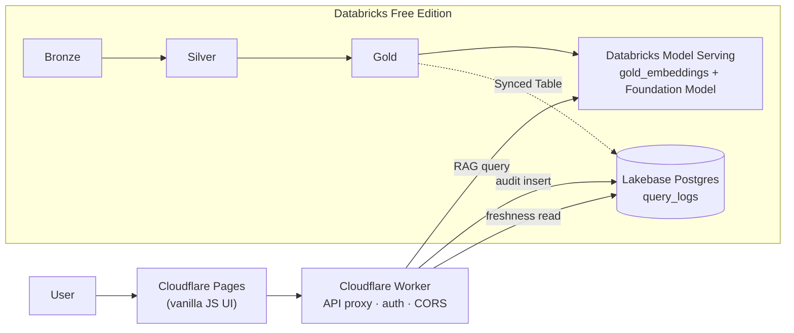

# Justice Compass 🍁⚖️

A Canadian legal case **RAG (Retrieval-Augmented Generation)** assistant, focused on **BC Liquor Control and Licensing Act** jurisprudence — built end-to-end on a **Databricks Lakehouse** (Medallion architecture + Lakebase) and served through **Cloudflare's edge** (Workers + Pages), with **AI-reviewed CI/CD** on every pull request.

Ask a question like *"When can BC revoke a liquor licence?"* and get a plain-language answer with **cited sources**, generated from a synthetic demo corpus of BC case law in `data/sample/`.

> **This is a portfolio / reference project**, not a production legal product. It ships pointed at the author's own demo deployment by default — follow the guide below to stand up your **own independent instance** (all free-tier).

---

## Why this exists

| Layer | What it demonstrates |
|-------|----------------------|
| **Medallion Architecture** | Bronze → Silver → Gold Delta pipeline (`databricks/notebooks/`) |
| **Lakehouse ↔ Operational DB** | Lakebase Synced Tables (Lake→Base) + query audit log (Base) |
| **RAG / vector retrieval** | Delta `gold_embeddings` + cosine similarity, served via an MLflow pyfunc model |
| **Edge-serverless API** | Cloudflare Worker proxy (auth, CORS, freshness metadata) + Pages static UI |
| **AI-native CI/CD** | A different LLM (Gemini) reviews every PR opened against this repo |
| **Zero-cost stack** | Runs entirely on free tiers — see [Prerequisites](#prerequisites) |

---

## Architecture



1. User asks a question on the **Pages** UI.
2. The **Worker** forwards it to a **Databricks Model Serving** endpoint (or returns a mock answer if not configured yet).
3. The Serving endpoint retrieves the top-k chunks from **Delta `gold_embeddings`** (cosine similarity) and asks a Foundation Model to answer using only that context.
4. The answer + citations are returned to the UI; the query is logged to **Lakebase** for audit.
5. The homepage shows **corpus / docs / model freshness**, read from Lakebase and MLflow via the Worker's `/meta` endpoint.

Deeper dives: [`docs/ARCHITECTURE.md`](docs/ARCHITECTURE.md) · [`docs/LAKEBASE.md`](docs/LAKEBASE.md) · [`docs/JOBS.md`](docs/JOBS.md) · [`docs/DATA_GOVERNANCE.md`](docs/DATA_GOVERNANCE.md)

---

## Prerequisites

All free tiers — no credit card charge required for the MVP scope.

| Account | Used for | Sign up |
|---------|----------|---------|
| **GitHub** | Host your fork, run CI/CD | Free plan is enough (unlimited private repos too) |
| **Cloudflare** | Worker (API) + Pages (UI) | [dash.cloudflare.com/sign-up](https://dash.cloudflare.com/sign-up) |
| **Databricks Free Edition** | Medallion pipeline, RAG serving, Lakebase | [databricks.com/learn/free-edition](https://www.databricks.com/learn/free-edition) |
| **Google AI Studio** *(optional)* | Gemini API key for the AI PR-review workflow | [aistudio.google.com/apikey](https://aistudio.google.com/apikey) |

Local tooling: **Node.js 20+**, **Python 3.10+**, [`wrangler`](https://developers.cloudflare.com/workers/wrangler/) CLI (installed via `npm install`).

---

## ⚠️ Personalization checklist — things you MUST change

This repo works out of the box against the **author's own** demo Worker/Pages deployment. To run your **own independent instance**, change these:

| # | File | What's hardcoded | Change to |
|---|------|-------------------|-----------|
| 1 | `cloudflare/pages/js/config.js` | Author's Worker URL (`justice-compass-api.justicebrobro.workers.dev`) | Your own deployed Worker URL (Step 2 below) — or use `config.local.js` locally (already supported, just add the file) |
| 2 | `.github/workflows/deploy-pages.yml` (`--project-name=justice-compass`) | Cloudflare Pages project name | Match whatever name you give your Pages project in Step 3, **or** just name your project `justice-compass` |
| 3 | Databricks secret scope name `justice-compass` | Referenced by every notebook (`databricks/lakebase/secret_utils.py` etc.) | Create a scope with this **exact name** in your own workspace (Step 4) — simplest path, no code change needed |
| 4 | GitHub Actions secrets (`DATABRICKS_HOST`, `DATABRICKS_TOKEN`, `CLOUDFLARE_API_TOKEN`, `GEMINI_API_KEY`, ...) | N/A — never committed | Add your own in **Settings → Secrets and variables → Actions** (Step 7) |
| 5 | Any `garmenty485/justice-compass` references in `docs/*.md` comments | Author's original private repo path | Cosmetic only — safe to ignore, or replace with your fork's path |

---

## Full setup guide

### Step 1 — Fork & clone

```bash
git clone https://github.com/<you>/justice-compass-canada.git
cd justice-compass-canada
npm install --prefix cloudflare/worker
```

### Step 2 — Cloudflare Worker (API)

```bash
cd cloudflare/worker
npx wrangler login
npx wrangler deploy
```

Note the deployed URL (e.g. `https://justice-compass-api.<your-subdomain>.workers.dev`). Without secrets set, `/query` returns a **mock answer** — that's expected until Step 4/6.

```bash
curl https://<your-worker>.workers.dev/health
# { "status": "ok", "databricks_configured": false, ... }
```

### Step 3 — Cloudflare Pages (UI)

**Dashboard** (recommended first time):

1. **Workers & Pages** → **Create** → **Pages** → **Connect to Git** → your fork
2. Branch: `main` (or wherever you push) · **Build output directory**: `cloudflare/pages`
3. Deploy → open the Pages URL

Then edit **`cloudflare/pages/js/config.js`** to point `window.JUSTICE_COMPASS_API` at *your* Worker URL from Step 2, commit, and redeploy.

### Step 4 — Databricks Free Edition (Medallion pipeline + RAG)

1. Sign up → **Repos / Git folders** → clone your fork into the workspace.
2. Create a **secret scope** named exactly `justice-compass` (Databricks CLI: `databricks secrets create-scope justice-compass`).
3. Run notebooks in order from `databricks/notebooks/`:
   `01_bronze_ingest` → `02_silver_transform` → `03_gold_embed` → `04_rag_serving` (interactive sanity check) → `05_deploy_serving` (registers the model + creates the **Model Serving** endpoint).
4. If the endpoint doesn't come up from `05`, run `06_create_serving_endpoint_api` (REST-API fallback for a Free Edition UI quirk).
5. Copy the endpoint's **invocation URL**, e.g. `https://<workspace>.cloud.databricks.com/serving-endpoints/justice-compass-rag-endpoint/invocations`.

Full step-by-step + troubleshooting table: [`docs/DEPLOY_PHASE2.md`](docs/DEPLOY_PHASE2.md) · [`docs/SETUP.md`](docs/SETUP.md)

### Step 5 — Lakebase (recommended, not strictly required)

Lakebase powers query audit logging and the homepage "last updated" freshness indicators.

1. Databricks → **Lakebase** → create a project (Free Edition: 1 project/account) → run [`databricks/sql/lakebase_schema.sql`](databricks/sql/lakebase_schema.sql) in its SQL editor.
2. Create a **custom Postgres role + native password** (not OAuth — see [`docs/LAKEBASE.md`](docs/LAKEBASE.md) for why).
3. Store `lakebase_host` / `lakebase_db` / `lakebase_user` / `lakebase_password` in the `justice-compass` secret scope.
4. Run `07_lakebase_setup` to sanity-check the connection, then `09_synced_tables_setup` to set up the corpus Synced Table (see [`databricks/prod_notebooks_job/SETUP.md`](databricks/prod_notebooks_job/SETUP.md)).

### Step 6 — Wire the Worker to Databricks + Lakebase

```bash
cd cloudflare/worker
npx wrangler secret put DATABRICKS_SERVING_URL   # the .../invocations URL from Step 4
npx wrangler secret put DATABRICKS_TOKEN         # Databricks PAT — Settings → Developer → Access tokens
npx wrangler secret put LAKEBASE_HOST            # optional, enables audit log + freshness
npx wrangler secret put LAKEBASE_DB
npx wrangler secret put LAKEBASE_USER
npx wrangler secret put LAKEBASE_PASSWORD
npx wrangler deploy
```

Full secrets reference: [`.env.example`](.env.example) · [`docs/secrets_map.md`](docs/secrets_map.md)

### Step 7 — GitHub Actions (optional — CI/CD automation)

Only needed if you want auto-deploy on push, AI-reviewed PRs, or the scheduled prod pipeline. Add these under **Settings → Secrets and variables → Actions → Secrets**:

| Secret | Enables |
|--------|---------|
| `CLOUDFLARE_API_TOKEN` | `deploy-cloudflare.yml` / `deploy-pages.yml` — auto-deploy on push |
| `GEMINI_API_KEY` | `ai-pr-review.yml` — AI code review comments on PRs |
| `DATABRICKS_HOST`, `DATABRICKS_TOKEN`, `DATABRICKS_REPO_ID`, `DATABRICKS_PROD_JOB_ID` | `prod-seed-and-pipeline.yml` — scheduled prod pipeline (see [`databricks/prod_notebooks_job/README.md`](databricks/prod_notebooks_job/README.md)) |

All are independent — skip any workflow you don't need.

### Step 8 — Verify

```bash
curl https://<your-worker>.workers.dev/health
# "databricks_configured": true, "lakebase_configured": true

curl "https://<your-worker>.workers.dev/query?q=When+can+BC+revoke+a+liquor+licence"
# "mock": false, real answer + citations
```

Open your Pages URL and ask a question in the UI — you should see a cited answer and the homepage freshness indicators populated.

---

## Local development

```bash
npm install --prefix cloudflare/worker
npm run dev:worker            # Worker at http://localhost:8787 (mock mode without secrets)
npx serve cloudflare/pages    # or just open cloudflare/pages/index.html
```

Local Worker secrets go in `cloudflare/worker/.dev.vars` (gitignored) — see [`.env.example`](.env.example).

## Testing

```bash
npm test          # Worker unit tests
npm run lint:worker
python tests/pipeline_smoke_test.py   # sample data validation
```

---

## Repo structure

| Path | Purpose |
|------|---------|
| `cloudflare/pages/` | Static UI (vanilla JS) |
| `cloudflare/worker/` | Edge API proxy |
| `databricks/notebooks/` | Medallion pipeline (dev) + RAG serving |
| `databricks/prod_notebooks_job/` | Same pipeline, wired for the scheduled GitHub Actions → Databricks Job flow |
| `databricks/lakebase/` | Lakebase connection + sync helpers |
| `databricks/sql/` | Lakebase DDL |
| `data/sample/` | Synthetic BC liquor-licensing demo cases (JSON) |
| `tests/` | Worker unit tests + pipeline smoke tests |
| `docs/` | Architecture, setup, governance, Lakebase, Jobs, secrets reference |
| `.github/workflows/` | CI, AI PR review, Cloudflare deploy, scheduled prod pipeline |

## More docs

- [`docs/SETUP.md`](docs/SETUP.md) — account-by-account setup checklist
- [`docs/DEPLOY_PHASE2.md`](docs/DEPLOY_PHASE2.md) — live RAG deploy walkthrough + troubleshooting table
- [`docs/ARCHITECTURE.md`](docs/ARCHITECTURE.md) — request flow + data layers
- [`docs/DATA_GOVERNANCE.md`](docs/DATA_GOVERNANCE.md) — naming conventions, lineage, quality checks
- [`docs/LAKEBASE.md`](docs/LAKEBASE.md) — Lake↔Base integration model, auth decisions
- [`docs/JOBS.md`](docs/JOBS.md) — dev vs. prod Databricks Jobs, GHA automation
- [`docs/secrets_map.md`](docs/secrets_map.md) — every secret, where it lives, what needs it

---

## Data & attribution

The demo corpus in `data/sample/` is **entirely synthetic** — invented case names and facts styled after real BC liquor-licensing jurisprudence, for demo purposes only. It is **not** scraped or redistributed from [CanLII](https://www.canlii.org/) or any court registry. For real case law, consult [CanLII](https://www.canlii.org/en/info/api.html) or [BC Laws](https://www.bclaws.gov.bc.ca/) directly.

## Legal disclaimer

This tool provides informational summaries of (synthetic, demo) court decisions. **It is not legal advice.** Always consult a qualified lawyer for legal matters.

## License

[MIT](LICENSE) — free to use, fork, and adapt for your own portfolio or learning purposes.
