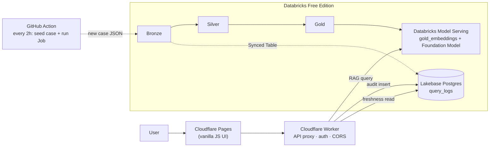

# Justice Compass — 操作步驟（中文簡潔版）

[← English full README](README.md)

> 這份文件只列**操作步驟**，不重複介紹（面試官已經聽過口頭介紹）。全部帳號皆為免費方案。



---

## 事前準備（帳號）

- GitHub（fork 這個 repo）
- Cloudflare（[dash.cloudflare.com/sign-up](https://dash.cloudflare.com/sign-up)）
- Databricks Free Edition（[databricks.com/learn/free-edition](https://www.databricks.com/learn/free-edition)）
- Google AI Studio（選填，AI PR review 用：[aistudio.google.com/apikey](https://aistudio.google.com/apikey)）

本機工具：Node.js 20+、Python 3.10+。

---

## ⚠️ 必改清單

| # | 檔案 | 內容 | 改成 |
|---|------|------|------|
| 1 | `cloudflare/pages/js/config.js` | 作者本人的 Worker URL | 你自己部署的 Worker URL（步驟 2） |
| 2 | `.github/workflows/deploy-pages.yml` 的 `--project-name=justice-compass` | Cloudflare Pages 專案名 | 對齊你在步驟 3 建立的專案名，或直接沿用 `justice-compass` |
| 3 | Databricks secret scope 名稱 `justice-compass` | 所有 notebook 都寫死這個名字 | 在你自己的 workspace 建同名 scope（步驟 4） |
| 4 | GitHub Secrets | 從未進 repo | 自行在 **Settings → Secrets and variables → Actions** 新增（步驟 7–8） |
| 5 | `docs/*.md` 裡殘留的 `garmenty485/justice-compass` 引用 | 作者原本私有 repo 的路徑 | 純裝飾性文字，可忽略，或換成你自己 fork 的路徑 |

---

## 步驟 1 — Fork & Clone

**目的**：取得你自己的專案副本與相依套件——後面所有步驟都建立在這上面。

```bash
git clone https://github.com/<你的帳號>/justice-compass-canada.git
cd justice-compass-canada
npm install --prefix cloudflare/worker
```

## 步驟 2 — Cloudflare Worker（API）

**目的**：部署你自己的 edge API 代理層——之後所有步驟（UI、Databricks、Lakebase）都會接到這個 Worker。

```bash
cd cloudflare/worker
npx wrangler login
npx wrangler deploy
```

記下部署的 URL。沒設 secrets 前，`/query` 會回傳 mock 答案（正常，等步驟 4/6）。

```bash
curl https://<你的worker>.workers.dev/health
```

## 步驟 3 — Cloudflare Pages（UI）

**目的**：部署使用者（或你自己）實際會打開來問問題的網頁介面。

**Dashboard**（第一次建議用這個）：

1. Cloudflare Dashboard → **Workers & Pages** → **Create** → **Pages** → **Connect to Git** → 選你的 fork
2. Branch：`main`（或你實際 push 的分支）；**Build output directory**：`cloudflare/pages`
3. Deploy

改 `cloudflare/pages/js/config.js` 裡的 Worker URL 為你自己的（步驟 2），commit + 重新 deploy。

## 步驟 4 — Databricks Free Edition

**目的**：把示範判例跑過完整的 Medallion pipeline（Bronze→Silver→Gold），並部署成一個可查詢的 RAG serving endpoint。

1. 註冊 → **Repos / Git folders** → clone 你的 fork
2. 建立 secret scope，名稱必須是 `justice-compass`：
   ```bash
   databricks secrets create-scope justice-compass
   ```
3. 依序 Run all `databricks/notebooks/`：
   `01_bronze_ingest` → `02_silver_transform` → `03_gold_embed` → `04_rag_serving`（互動測試）→ `05_deploy_serving`（註冊模型 + 建立 Model Serving endpoint）
4. 若 `05` 沒成功建立 endpoint，跑 `06_create_serving_endpoint_api`（REST API 補救）
5. 複製 endpoint 的 **invocation URL**（`.../serving-endpoints/.../invocations`）

詳細疑難排解：[`docs/DEPLOY_PHASE2.md`](docs/DEPLOY_PHASE2.md) · [`docs/SETUP.md`](docs/SETUP.md)

## 步驟 5 — Lakebase（建議做，非必要）

**目的**：Lakebase 支援查詢稽核紀錄，以及首頁的「最後更新時間」freshness 顯示。

1. Databricks → **Lakebase** → 建立 project → SQL Editor 執行 [`databricks/sql/lakebase_schema.sql`](databricks/sql/lakebase_schema.sql)
2. 建立**自訂 Postgres role + 固定密碼**（非 OAuth）
3. 把 `lakebase_host` / `lakebase_db` / `lakebase_user` / `lakebase_password` 存進 `justice-compass` secret scope
4. 跑 `07_lakebase_setup` 驗證連線，再跑 `09_synced_tables_setup` 設定 Synced Table（詳見 [`databricks/prod_notebooks_job/SETUP.md`](databricks/prod_notebooks_job/SETUP.md)）

> **Free Edition 只支援單向**：本專案只做 **Lake → Base**（Synced Tables，`09`），把 `cases_metadata` 複製進 Lakebase。刻意沒有依賴 **Base → Lake**（Lakebase Change Data Feed）——在 Free Edition 上，CDF 的目的地必須是「有自己雲端儲存位置」的 Unity Catalog catalog，但 Free Edition workspace 只有預設（default）儲存，目的地 Delta 表永遠建不出來（[已在 Databricks 社群確認](https://community.databricks.com/t5/data-engineering/lakebase-cdf-destination-delta-table-not-created-after/m-p/162161#M55045)）。這不是 bug——只有付費 workspace（catalog 掛自訂雲端儲存位置）才支援雙向。

## 步驟 6 — 把 Worker 接到 Databricks + Lakebase

**目的**：把步驟 2 的 Worker 接到剛部署好的 Databricks + Lakebase，讓 `/query` 不再回傳 mock 答案。

```bash
cd cloudflare/worker
npx wrangler secret put DATABRICKS_SERVING_URL   # 步驟4的 invocation URL
npx wrangler secret put DATABRICKS_TOKEN         # Databricks PAT
npx wrangler secret put LAKEBASE_HOST            # 選填
npx wrangler secret put LAKEBASE_DB
npx wrangler secret put LAKEBASE_USER
npx wrangler secret put LAKEBASE_PASSWORD
npx wrangler deploy
```

## 步驟 7 — GitHub Actions：CI + 自動部署（選填）

**目的**：讓 CI 檢查、Worker/Pages 部署、AI PR review 在 push/PR 時自動跑——全部選填，app 本身能不能動完全不需要這些。

`ci.yml`（lint + unit test + sample-data smoke test）不需要任何 secret 就能跑——這是本模板**唯一預設就會啟用**的 workflow，所以 Actions 頁面預設就應該是綠的。

`deploy-cloudflare.yml` 跟 `deploy-pages.yml` 都存在，但它們的 `push` 觸發**預設是註解掉的**（不然你一編輯這兩個檔案，還沒設 Cloudflare token 就會自動觸發並失敗）。要啟用「push 到 `main` 自動部署」：

1. 在 **Settings → Secrets and variables → Actions → Secrets** 新增 `CLOUDFLARE_API_TOKEN`。
2. 分別打開 `.github/workflows/deploy-cloudflare.yml` 跟 `deploy-pages.yml`，取消註解 `push:` 那一區塊（檔案裡有內嵌說明）。
3. commit + push——或者不啟用自動觸發，直接用 **Actions → Deploy Cloudflare Worker/Pages → Run workflow** 隨時手動觸發。

在同一個 Secrets 頁面新增 `GEMINI_API_KEY` 可以啟用 `ai-pr-review.yml`——AI（Gemini）會在每個 PR 上留一則 review 留言。這個 workflow 只會在 PR 時觸發，一般 push 完全不會動，所以加了這個 secret 是安全的，不需要額外步驟。

## 步驟 8 — 完整自動化：排程 prod pipeline（進階，選填）

**目的**：達到跟作者本人完全一樣的最終狀態——**每 2 小時**自動 seed 測試案例 → push → 通知 Databricks pull → 觸發 Job 跑完整 pipeline（`01→02→03→05→09`），全程不需人工介入。

**預設是關閉的**（`.github/workflows/prod-seed-and-pipeline.yml` 的 `schedule` 已註解掉），因為需要先完成步驟 4–6。準備好之後：

1. **取得 Databricks PAT + host**：Databricks → 右上角帳號 → **Settings** → **Developer** → **Access tokens** → **Generate new token**。`DATABRICKS_HOST` = 你的 workspace URL（結尾不要加 `/`）。

2. **找到 `DATABRICKS_REPO_ID`**：
   - UI：打開你的 Git folder，瀏覽器網址列 `#folder/` 後面的數字就是 repo ID
   - 或用 API：
     ```bash
     curl -s -H "Authorization: Bearer $DATABRICKS_TOKEN" \
       "$DATABRICKS_HOST/api/2.0/repos" | python3 -m json.tool
     ```
     找到 `path` 對應你的 Git folder，複製它的 `id`

3. **建立 prod Job，取得 `DATABRICKS_PROD_JOB_ID`**：
   - 打開 [`databricks/prod_notebooks_job/create_prod_pipeline_job.py`](databricks/prod_notebooks_job/create_prod_pipeline_job.py) → **Run all**
   - 會建立/更新 Job `justice-compass-prod-pipeline` 並印出 `job_id`
   - 前提：步驟 5 的 Lakebase Synced Table 要先建好（這個 Job 會跑 `05`/`09`）

4. **新增 4 個 GitHub Secrets**：`DATABRICKS_HOST`、`DATABRICKS_TOKEN`、`DATABRICKS_REPO_ID`、`DATABRICKS_PROD_JOB_ID`

5. **先手動測試**：**Actions** 頁籤 → **Prod seed and pipeline** → **Run workflow**，確認跑綠

6. **開啟每 2 小時排程**（最後一步，達到跟作者完全一樣的狀態）：編輯 `.github/workflows/prod-seed-and-pipeline.yml`，取消註解：

   ```yaml
   on:
     schedule:
       - cron: "0 */2 * * *"
     workflow_dispatch:
   ```

   commit + push 到 `main`。之後你的 fork 會自動每 2 小時跑一次完整流程，不用再手動操作。

## 步驟 9 — 驗證

**目的**：確認整條鏈路真的接通了，不是還在 mock 模式。

```bash
curl https://<你的worker>.workers.dev/health
# databricks_configured: true, lakebase_configured: true

curl "https://<你的worker>.workers.dev/query?q=When+can+BC+revoke+a+liquor+licence"
# mock: false，有真實答案 + 引用
```

打開你的 Pages URL，實際問一個問題，確認畫面上有引用來源、首頁有 freshness 時間顯示。

---

## 測試

```bash
npm test
npm run lint:worker
python tests/pipeline_smoke_test.py
```

---

更完整的架構說明、疑難排解、Lakebase/Jobs 細節，請看英文版 [README.md](README.md) 與 [`docs/`](docs/) 資料夾。
