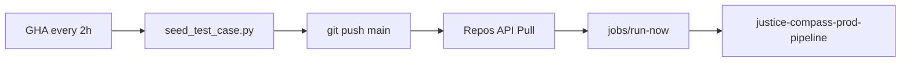

# Databricks Jobs — 編排範圍與自動化

> **更新（2026-07-09）**：Prod 全鏈由 **GHA 每 2h** 觸發；notebook 統一在 `databricks/prod_notebooks_job/`。

---

## 兩條 Job

| Job | 路徑 | Tasks | 觸發 |
|-----|------|-------|------|
| **`justice-compass-medallion`** | `databricks/notebooks/` | 01 → 02 → 03 | 手動 / `08_create_medallion_job` |
| **`justice-compass-prod-pipeline`** | `databricks/prod_notebooks_job/` | 01 → 02 → 03 → 05 → 09 | **GHA** `prod-seed-and-pipeline`（無 Job schedule） |

---

## Prod 自動化（GHA → Databricks）

Workflow：`.github/workflows/prod-seed-and-pipeline.yml`  
建立 Job：`create_prod_pipeline_job`（見 `databricks/prod_notebooks_job/README.md`）

### GitHub Secrets

| Secret | 用途 |
|--------|------|
| `DATABRICKS_HOST` | Workspace URL |
| `DATABRICKS_TOKEN` | PAT（Repos + Jobs） |
| `DATABRICKS_REPO_ID` | Git folder repo id |
| `DATABRICKS_PROD_JOB_ID` | Prod Job id |

---

## Dev Job：`justice-compass-medallion`（01 → 03）

| Notebook | 做什麼 | Job |
|----------|--------|-----|
| **01** `bronze_ingest` | Sample JSON → `bronze_cases` | ✅ |
| **02** `silver_transform` | chunk → `silver_chunks` | ✅ |
| **03** `gold_embed` | Embedding → `gold_embeddings` | ✅ |
| **04** `rag_serving` | 互動 demo | ❌ |
| **05** `deploy_serving` | MLflow + Serving | ❌（prod Job 內） |
| **06** | Endpoint REST 補救 | ❌ 手動 |

建立：Git Pull → **`08_create_medallion_job`**

---

## Prod notebooks（`prod_notebooks_job/`）

| Notebook | 與 dev 差異 |
|----------|-------------|
| **01–03** | 複製自 dev；path marker → `prod_notebooks_job` |
| **05** | 同上；每輪 GHA 可能 re-deploy Serving |
| **09_sync_cases_prod** | **精簡**：`cases_metadata` + trigger Synced Table；無 UI setup / `public.cases` fallback |

一次性 Synced Table UI：[`prod_notebooks_job/SETUP.md`](../databricks/prod_notebooks_job/SETUP.md)

---

## 為什麼 04 不在任何 Job？

**04** 是開發者試問 RAG 的互動 notebook，不產生 batch 產物。

---

## Serving 更新（prod 05）

| 原則 | 說明 |
|------|------|
| **Worker URL 不變** | `DATABRICKS_SERVING_URL` 固定 endpoint |
| **可觀測** | `pipeline_runs` layer=`serving` |
| **失敗可回退** | 新版本 build 失敗時舊 entity 通常仍 serve |

---

## 典型操作

### 開發

1. 改 `data/sample/` 或 notebook → Pull → 手動 medallion Job 或 01→03  
2. 需要對外更新 → 手動 `05`（dev notebook）

### Prod（設定完成後）

1. GHA 每 2h 自動：seed → push → Pull → prod Job  
2. 首頁 `/meta` corpus / model 時間隨 Job 更新

---

## Free Edition 配額

- Jobs：prod 5 tasks；medallion 3 tasks（分開 Job，各 `max_concurrent_runs: 1`）
- Prod 每 2h 跑 **05** 需注意 Serving 配額

---

## Checklist

- [x] Medallion Job 01→03  
- [x] Prod Job 01→05→09 + GHA workflow（secrets 檢查 + Job 輪詢）  
- [x] Synced Table `workspace.default.cases_meta_synced` + `INSERT OVERWRITE` 09  
- [ ] Databricks scope `synced_table_uc_name` + 重跑 `create_prod_pipeline_job`  
- [ ] `workflow_dispatch` 驗收一輪全綠  
- [x] Worker `/meta` 預設 `cases_meta_synced`
