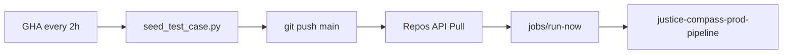

# Databricks Jobs — Orchestration Scope and Automation

> The full prod chain is triggered by **GHA every 2h** (see README Step 8); prod notebooks live under `databricks/prod_notebooks_job/`.

---

## Two Jobs

| Job | Path | Tasks | Trigger |
|-----|------|-------|------|
| **`justice-compass-medallion`** | `databricks/notebooks/` | 01 → 02 → 03 | Manual / `08_create_medallion_job` |
| **`justice-compass-prod-pipeline`** | `databricks/prod_notebooks_job/` | 01 → 02 → 03 → 05 → 09 | **GHA** `prod-seed-and-pipeline` (no Job-level schedule) |

---

## Prod automation (GHA → Databricks)

Workflow: `.github/workflows/prod-seed-and-pipeline.yml`
Job creation: `create_prod_pipeline_job` (see `databricks/prod_notebooks_job/README.md`)

### GitHub Secrets

| Secret | Purpose |
|--------|------|
| `DATABRICKS_HOST` | Workspace URL |
| `DATABRICKS_TOKEN` | PAT (Repos + Jobs) |
| `DATABRICKS_REPO_ID` | Git folder repo id |
| `DATABRICKS_PROD_JOB_ID` | Prod Job id |

---

## Dev Job: `justice-compass-medallion` (01 → 03)

| Notebook | What it does | In Job |
|----------|--------|-----|
| **01** `bronze_ingest` | Sample JSON → `bronze_cases` | ✅ |
| **02** `silver_transform` | chunk → `silver_chunks` | ✅ |
| **03** `gold_embed` | Embedding → `gold_embeddings` | ✅ |
| **04** `rag_serving` | Interactive demo | ❌ |
| **05** `deploy_serving` | MLflow + Serving | ❌ (part of the prod Job) |
| **06** | Endpoint REST fallback | ❌ manual |

Create it: Git Pull → **`08_create_medallion_job`**

---

## Prod notebooks (`prod_notebooks_job/`)

| Notebook | Difference from dev |
|----------|-------------|
| **01–03** | Copied from dev; path marker → `prod_notebooks_job` |
| **05** | Same as above; each GHA cycle may re-deploy Serving |
| **09_sync_cases_prod** | **Streamlined**: `cases_metadata` + trigger the Synced Table; no UI setup / `public.cases` fallback |

One-time Synced Table UI setup: [`prod_notebooks_job/SETUP.md`](../databricks/prod_notebooks_job/SETUP.md)

---

## Why is `04` not part of any Job?

**04** is an interactive notebook developers use to try out RAG questions manually; it does not produce any batch artifact.

---

## Serving updates (prod `05`)

| Principle | Explanation |
|------|------|
| **Worker URL never changes** | `DATABRICKS_SERVING_URL` points to a fixed endpoint |
| **Observable** | `pipeline_runs` records a `serving` layer row |
| **Rollback-safe** | If a new version's build fails, the previous entity usually keeps serving |

---

## Typical workflows

### Development

1. Edit `data/sample/` or a notebook → Pull → run the medallion Job manually, or 01→03 individually
2. Need to push an update live → run `05` manually (dev notebook)

### Prod (once set up)

1. Every 2h, GHA automatically: seeds → pushes → Pulls → runs the prod Job
2. Homepage `/meta` corpus / model timestamps update as the Job runs

---

## Free Edition quotas

- Jobs: prod uses 5 tasks; medallion uses 3 tasks (separate Jobs, each with `max_concurrent_runs: 1`)
- Running **05** every 2h in prod — keep an eye on Serving quota

---

## Checklist

> This reflects the current state of this project's own workspace (the author's), not a checklist for you to complete after forking — for your own setup steps, see the main README.

- [x] Medallion Job 01→03
- [x] Prod Job 01→05→09 + GHA workflow (secrets check + Job polling)
- [x] Synced Table `workspace.default.cases_meta_synced` + `INSERT OVERWRITE` in `09`
- [ ] Databricks scope `synced_table_uc_name` + rerun `create_prod_pipeline_job`
- [ ] One fully green `workflow_dispatch` run
- [x] Worker `/meta` defaults to `cases_meta_synced`
