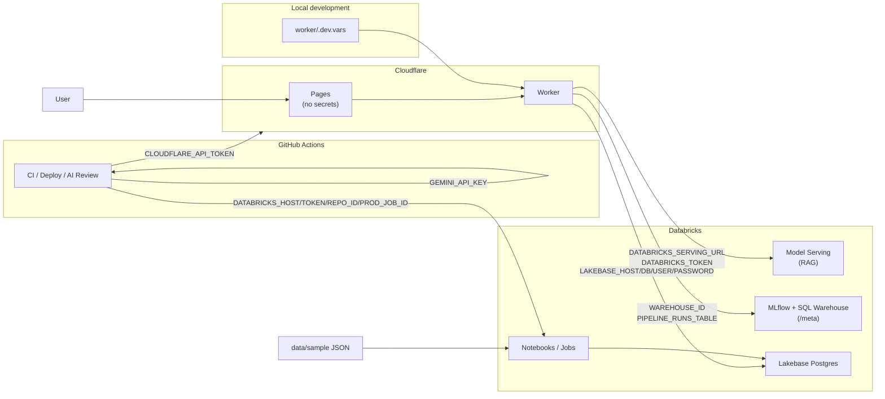

# Secrets Map

> Overview of the data flow and required secrets / keys for each component in this project.
> See [SETUP.md](SETUP.md), [DEPLOY_PHASE2.md](DEPLOY_PHASE2.md), [LAKEBASE.md](LAKEBASE.md), and [`.env.example`](../.env.example) for setup details.

---

## Flow + Secrets



---

## What each component needs, and where it goes

| Component | Secrets / Keys | Where |
|------|----------------|------|
| **Cloudflare Worker** (required for RAG) | `DATABRICKS_SERVING_URL`, `DATABRICKS_TOKEN` | `wrangler secret put` or `cloudflare/worker/.dev.vars` |
| **Cloudflare Worker** (optional) | `API_KEY` | Same as above |
| **Cloudflare Worker** (optional, `/meta` docs) | `DATABRICKS_WAREHOUSE_ID`, `LAKEBASE_PIPELINE_RUNS_TABLE` | Same as above |
| **Cloudflare Worker** (Lakebase) | `LAKEBASE_HOST`, `LAKEBASE_DB`, `LAKEBASE_USER`, `LAKEBASE_PASSWORD` | Same as above — used for `query_logs` writes + Synced Table corpus count |
| **Cloudflare Worker** (optional corpus table name) | `LAKEBASE_CASES_TABLE` | Defaults to `"default".cases_meta_synced` (Synced Table); do not use the empty `public.cases` |
| **GitHub Actions** | `GEMINI_API_KEY`, `CLOUDFLARE_API_TOKEN` | Repo → Settings → Secrets |
| **GitHub Actions** (prod pipeline) | `DATABRICKS_HOST`, `DATABRICKS_TOKEN`, `DATABRICKS_REPO_ID`, `DATABRICKS_PROD_JOB_ID` | See `databricks/prod_notebooks_job/README.md` |
| **Databricks Notebooks / Jobs** | Lakebase connection; `synced_table_uc_name`; `serving_*` | Databricks secret scope `justice-compass` |
| **Cloudflare Pages** | — | None |
| **Demo corpus** | — | Git `data/sample/` (no API key) |

---

## Quick reference

```
worker/.dev.vars         →  DATABRICKS_* / API_KEY / LAKEBASE_* (local Worker)
wrangler secret put      →  same, for the deployed Worker
GitHub Secrets           →  GEMINI_API_KEY / CLOUDFLARE_API_TOKEN / DATABRICKS_* (prod GHA)
Databricks secret scope  →  Lakebase credentials (used by notebooks)
```
